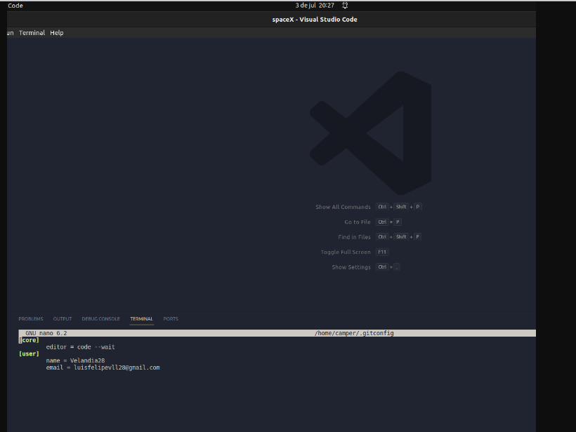

Inicialmente probé la extension con palabras clave en el apartado get

Luego probe el metodo post con las especificaciones del body y el link del repositorio

Ademas estuve probando el get one con los parametros que indica el repositorio

En el ultimo dia de entrega se realizo un commit en un computador de Kepler el cual tenia las credenciales abiertas de alguna persona lo cual afecto mi commit y se pusheo como si hubiera sido la otra persona, es mejor aclarar la situacion para evitar malentendidos y que asi se entienda que no se pueden eliminar los Contribuidores una vez hecho el push...

Adjunto la imagen de las credenciales abiertas con fecha y hora:

En cuanto al funcionamiento del proyecto, queria aclarar que debido al tiempo no logre integrar la funcionalidad del footer correctamente, aun asi no lo iba a dejar sin servir y le integre otro funcionamiento para que al menos se pudieran ver los slides 1 por 1 sin necesidad del footer...